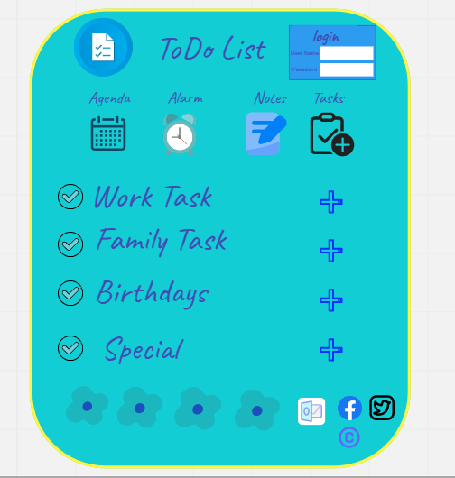
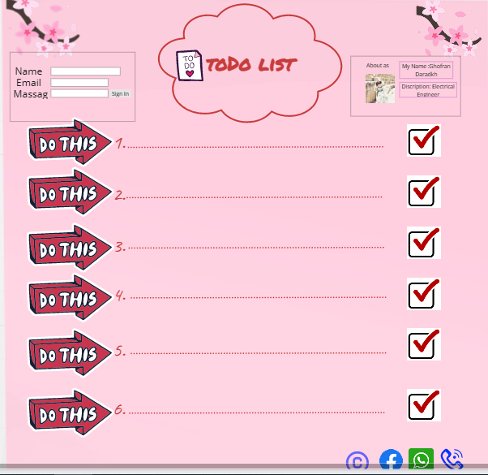

# todo-project
----

todo project is website that helping people to to their tasks on the time and not forget it .
all you have to sign in the website and enjoy your life because it make the tasks it easy and it's remmber you alway about all thinf yoy need to do .
---
### What we learned Tody lec#3
we take the difference between **Internet** **websites** and the **URLS** 
and started studing HTMl the standard markup language for Web pages, With HTML you can create your own Website.
and we took the basic HTML commands . and apply it in visual studio coe **VSC**.
 before i started i thought is need 3 hours time to do ,put it took 6 hours ! to do .
 
 

### What we learned Today lec#4
we take the **css** cascading style sheet 
and how to use elements in it , diffiernce between Inline and Block elements and how to change position for elements .

Its intersting and amazing it took 3 hours.

 